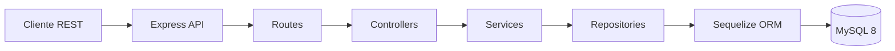
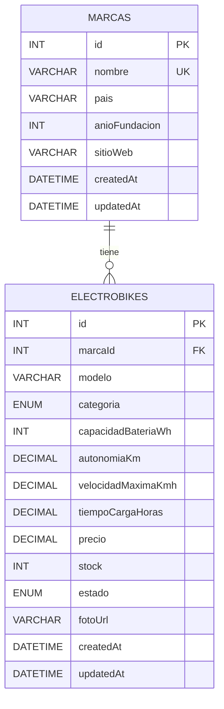

# QZMotorCenterElectroBike

Microservicio para la gestion de motocicletas electricas de QZ Motor Center. El proyecto toma como referencia la idea y la logica CRUD del ZIP `QZMotorCenterScooter`, pero la adapta a un dominio mas completo para `ElectroBike`, agregando una base de datos relacional real, asincronia explicita, Docker, pruebas unitarias y documentacion tecnica completa.

## Objetivo del microservicio

Este microservicio permite:

- Registrar marcas de motocicletas electricas.
- Registrar modelos `ElectroBike` asociados a una marca.
- Consultar el catalogo completo o filtrarlo.
- Consultar una unidad por id.
- Actualizar la informacion de una `ElectroBike`.
- Eliminar una `ElectroBike`.
- Obtener un resumen del catalogo con metricas agregadas.

## Tecnologias usadas

- `Node.js`
- `TypeScript`
- `Express`
- `Sequelize`
- `MySQL 8`
- `Docker` y `Docker Compose`
- `Vitest` para pruebas unitarias

## Arquitectura del microservicio

La aplicacion sigue una arquitectura por capas para separar responsabilidades:

- `routes`: expone los endpoints REST.
- `controllers`: recibe la solicitud HTTP y construye la respuesta.
- `services`: contiene la logica de negocio y validaciones.
- `repositories`: encapsula el acceso a datos con Sequelize.
- `models`: define las entidades relacionales.
- `config`: centraliza la conexion a base de datos.



## Modelo relacional

El modelo relacional se compone de dos entidades:

- `marcas`: almacena fabricantes o marcas.
- `electrobikes`: almacena los modelos electricos asociados a una marca.

Relacion:

- Una `marca` puede tener muchas `electrobikes`.
- Cada `electrobike` pertenece a una sola `marca`.



## Como se aprovecha la asincronia

El proyecto usa asincronia de forma real y no solo decorativa:

- Todas las operaciones HTTP estan implementadas con `async/await`.
- La conexion, autenticacion y sincronizacion con MySQL son asincronas.
- Los accesos a repositorio usan operaciones no bloqueantes de Sequelize.
- En `ElectroBikeService.create()` se usa `Promise.all()` para validar en paralelo:
  - existencia de la marca
  - duplicidad de modelo por marca
- En `ElectroBikeService.getCatalogSummary()` se usa `Promise.all()` para consultar en paralelo:
  - total de electrobikes
  - total disponibles
  - precio promedio
  - total de marcas
  - distribucion por estado

Eso permite aprovechar mejor el tiempo de espera de I/O y hace que el microservicio sea mas eficiente bajo carga.

## Estructura del proyecto

```text
src/
  app.ts
  server.ts
  config/
    database.ts
  controllers/
    BrandController.ts
    ElectroBikeController.ts
  errors/
    AppError.ts
  middlewares/
    errorHandler.ts
  models/
    Marca.ts
    ElectroBike.ts
    index.ts
  repositories/
    BrandRepository.ts
    ElectroBikeRepository.ts
    interfaces/
      IBrandRepository.ts
      IElectroBikeRepository.ts
  routes/
    brandRoutes.ts
    electroBikeRoutes.ts
    index.ts
  services/
    BrandService.ts
    ElectroBikeService.ts
  types/
    domain.ts
  utils/
    asyncHandler.ts
    validators.ts

tests/
  unit/
    services/
      BrandService.test.ts
      ElectroBikeService.test.ts
```

## Endpoints disponibles

### Salud del servicio

| Metodo | Ruta | Descripcion |
|---|---|---|
| `GET` | `/api/health` | Verifica que la API este activa |

### Marcas

| Metodo | Ruta | Descripcion |
|---|---|---|
| `GET` | `/api/marcas` | Lista todas las marcas |
| `POST` | `/api/marcas` | Crea una marca |

### ElectroBikes

| Metodo | Ruta | Descripcion |
|---|---|---|
| `GET` | `/api/electrobikes` | Lista todas las electrobikes |
| `GET` | `/api/electrobikes?marcaId=1&estado=disponible` | Filtra por marca o estado |
| `GET` | `/api/electrobikes?minAutonomiaKm=90&maxPrecio=30000` | Filtra por autonomia o precio |
| `GET` | `/api/electrobikes/resumen` | Devuelve metricas del catalogo |
| `GET` | `/api/electrobikes/:id` | Consulta una electrobike por id |
| `POST` | `/api/electrobikes` | Crea una electrobike |
| `PUT` | `/api/electrobikes/:id` | Actualiza una electrobike |
| `DELETE` | `/api/electrobikes/:id` | Elimina una electrobike |

## Ejemplos de payload

### Crear marca

`POST /api/marcas`

```json
{
  "nombre": "Zero Motorcycles",
  "pais": "Estados Unidos",
  "anioFundacion": 2006,
  "sitioWeb": "https://zeromotorcycles.com"
}
```

### Crear ElectroBike

`POST /api/electrobikes`

```json
{
  "marcaId": 1,
  "modelo": "DSR/X",
  "categoria": "doble_proposito",
  "capacidadBateriaWh": 17200,
  "autonomiaKm": 180,
  "velocidadMaximaKmh": 180,
  "tiempoCargaHoras": 3.5,
  "precio": 42000,
  "stock": 4,
  "estado": "disponible",
  "fotoUrl": "https://example.com/dsrx.png"
}
```

## Variables de entorno

El proyecto incluye `.env.example` y una copia local `.env` para facilitar pruebas.

| Variable | Descripcion | Ejemplo |
|---|---|---|
| `PORT` | Puerto de la API | `3000` |
| `DB_HOST` | Host de MySQL | `localhost` |
| `DB_PORT` | Puerto de MySQL | `3306` |
| `DB_NAME` | Nombre de la base de datos | `qz_electrobike` |
| `DB_USER` | Usuario de la base de datos | `electrobike_user` |
| `DB_PASSWORD` | Clave del usuario de la base de datos | `electrobike_pass` |
| `DB_AUTO_CREATE` | Si la API intenta crear la base | `false` |
| `MYSQL_ROOT_PASSWORD` | Password root del contenedor MySQL | `root_secret` |

## Ejecucion local

1. Instalar dependencias:

```bash
npm install
```

2. Verificar que MySQL este disponible con las credenciales del `.env`.

3. Ejecutar en desarrollo:

```bash
npm run dev
```

4. Compilar:

```bash
npm run build
```

5. Ejecutar version compilada:

```bash
npm start
```

## Ejecucion con Docker

1. Levantar base de datos y API:

```bash
docker compose up --build
```

2. Detener contenedores:

```bash
docker compose down
```

3. Eliminar tambien el volumen:

```bash
docker compose down -v
```

## Pruebas unitarias

Las pruebas unitarias se concentran en la capa de servicios para validar la logica de negocio sin depender de una base real.

Casos cubiertos:

- creacion correcta de una marca
- deteccion de marca duplicada
- creacion correcta de una electrobike
- error cuando la marca no existe
- generacion correcta del resumen asincrono del catalogo

Comando:

```bash
npm test
```

## Validaciones ejecutadas sobre este proyecto

Durante la construccion del microservicio se validaron estos comandos:

- `npm run build`
- `npm run check`
- `npm test`
- `docker compose --env-file .env.example config`

## Diferencias clave frente al ZIP de referencia

Comparado con `QZMotorCenterScooter`, este proyecto agrega:

- una relacion real `Marca -> ElectroBike`
- validaciones de negocio mas estrictas
- manejo centralizado de errores
- endpoint de resumen de catalogo
- uso explicito de `Promise.all()` para asincronia
- pruebas unitarias
- README tecnico con diagramas Mermaid
- configuracion lista para Docker Compose

## Resumen tecnico final

El microservicio cumple con los requisitos solicitados:

- esta basado en la logica del proyecto de referencia
- usa asincronia con `async/await` y `Promise.all()`
- esta dockerizado
- incluye pruebas unitarias
- usa una base de datos relacional
- documenta la arquitectura y el modelo de datos en el `README`

Si se desea ampliar despues, el siguiente paso natural seria agregar autenticacion, paginacion, migraciones formales y pruebas de integracion.
